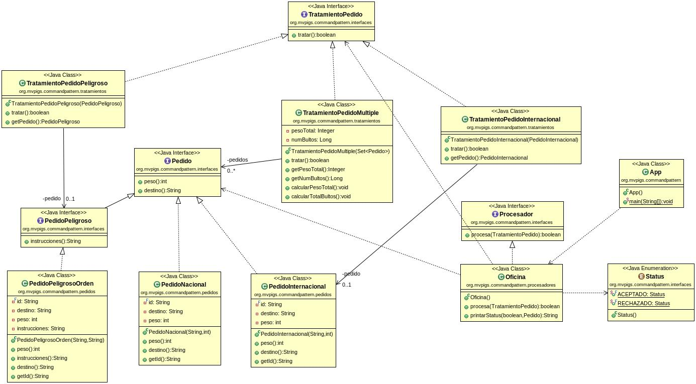

COMMAND PATTERN
===============

Programa la lógica de una oficina de correos que procesa pedidos.

En función de si el tratamiento del pedido es posible o no la oficina procesa el pedido (`true` /`false`) e informa de su estado (aceptado /rechazado).

Como los pedidos pueden ser de múltiples tipos, muchos de ellos aun desconocidos y cada uno con sus particularidades propias, vamos a usar el patrón de diseño de comportamiento **_command pattern_**.

Consulta el manual de referencia para ver un ejemplo del patrón:

Aplicando el patron COMMAND no procesaremos pedidos, sino que le pasaremos a la oficina (el **procesador**) el tipo de **tratamiento** que ha de aplicar a cada pedido, y será el propio pedido el que decida cómo debe ser tratado.

PASA LOS CASOS TEST PROPUESTOS y utilízalos como guia para el desarrollo practicando **TDD**. No puedes modificar el código de los casos test. 

La clase `App.java` contiene el `main` o script principal y ha de funcionar. No puedes modificar el código del método `main`.

Crea un proyecto **Maven** siguiendo el esquema: `org.mvpigs.commandpattern`

Respeta la estructura del proyecto indicada 
en el nombre de los paquetes que se indican en los casos test. 

- Realiza commits periódicamente mientras avanzas en el desarrollo de la aplicación.
- Publica tu solución en un repo en GitHub.
- Compártelo conmigo si es privado.
